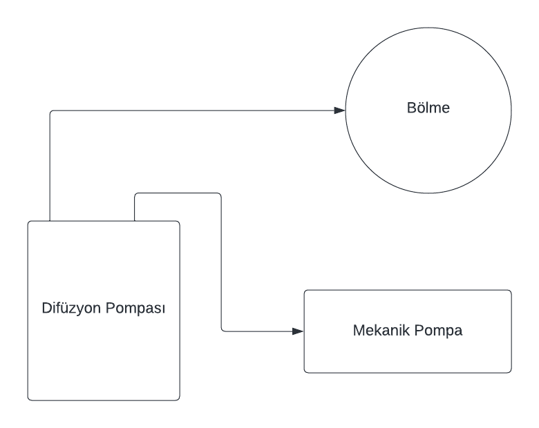
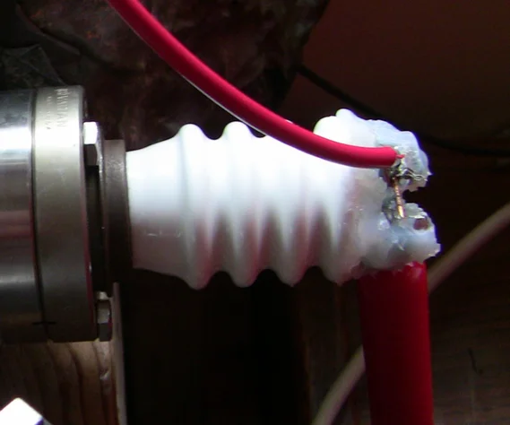
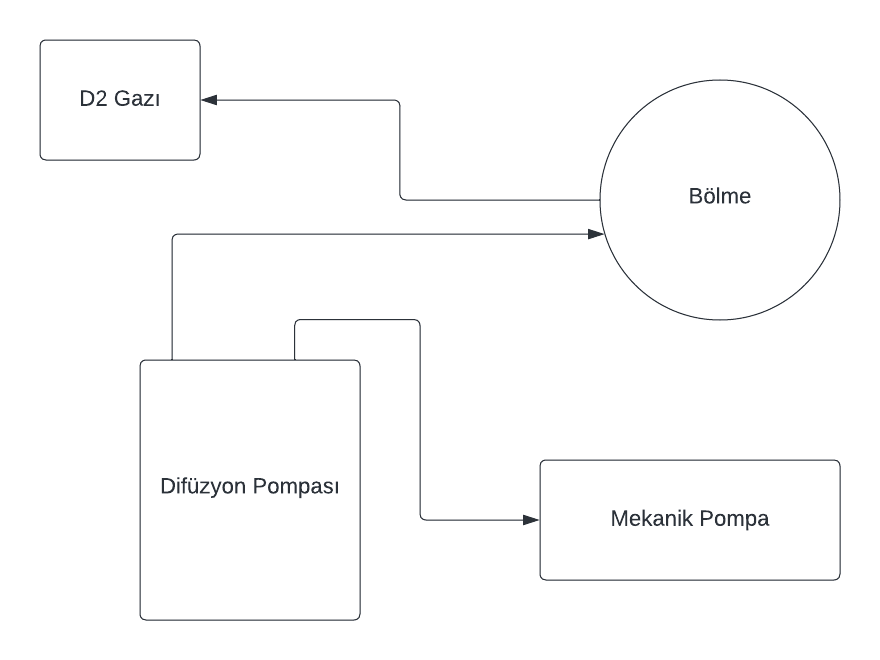

# Füzyon Reaktörü Nedir, Nasıl Yapılır ?

-> Yazar ve Editör: [M. Yasin Özkaya](https://github.com/yasinldev)

Merhabalar, bu yazımda sizlere füzyon reaktörü nasıl yapılır onu anlatacağım. Öncelikle füzyon'u ve füzyon reaktörü nedir onu açıklayayım. 

Füzyon; iki hafif elementin nükleer reaksiyonlar sonucu birleşerek daha ağır bir element oluşturmasıdır. Füzyon reaktörü ise bu reaksiyonu kontrol altında tutarak enerji elde etmeyi amaçlayan bir reaktördür.  

## Füzyon Reaktörü ne işe yarar ?

Füzyon reaktörleri, temel olarak iki hafif atomun birleşmesi (füzyon tepkimesi) sürecini kullanarak büyük miktarda enerji üretmeyi amaçlayan cihazlardır. 

Bu cihazlarda kullanılan yakıt genel olarak hidrojen izotoplarıdır. Bu izotoplar, hidrojenin ağır izotopu olan deüteryum ve trityumdur. Bu iki izotopun füzyonu sırasında, helyum ve yüksek enerjili nötronlar gibi ürünler meydana gelir.

### Neden Hidrojen İzotopları ?

Hidrojen izotopları, doğada bol miktarda bulunan ve neredeyse sınırsız bir kaynağa sahip olan yakıtlardır. Bu yakıtların füzyonu sırasında, yukarıda bahsettiğimiz gibi helyum ve yüksek enerjili nötronlar gibi ürünler meydana gelir. 

Bu ürünlerin bir kısmı, reaktörün içinde kalarak reaktörün ısınmasını sağlar. Diğer bir kısmı ise, reaktörün dışına çıkarak elektrik üretmek için kullanılır.

Hidrojen izotopları dışında, füzyon reaktörlerinde kullanılan diğer yakıtlar ise helyum ve lityumdur. Bu yakıtların füzyonu sırasında, helyum ve yüksek enerjili nötronlar gibi ürünler meydana gelir.

## Füzyon Tepkimesinden Nasıl Enerji Elde Edilir ?

Füzyon tepkimesi, iki hafif atomun birleşmesi sonucu daha ağır bir atom meydana getirdiğini söyledik. 

Bu tepkime sırasında, birleşen atomların kütlesi birleşen atomdan daha azdır. Bu kütlenin bir kısmı, tepkime sırasında açığa çıkan enerjiye dönüşür. Bu enerji, Einstein'ın E=mc² formülü ile açıklanır. 

Elde edilen enerjiyi yakalamak için, füzyon reaktörlerinde kullanılan yakıt, yüksek sıcaklıklarda tutulur. Bu sıcaklıklar, yakıtın plazma haline gelmesini sağlayarak yakıtın reaktörün içinde kalmasını sağlar ve genellikle buhar türbinleri ile elektrik üretmek için kullanılır. Bu kısıma aşağıda daha detaylı değinelim.

### Füzyon Reaktöründen Çıkan Enerji Nasıl Yakalanır ?

Füzyon reaksiyonunun ardından açığa çıkan enerjiyi yakalamanın temel iki yolu vardır. Bunlar Manyetik Sıkıştırma ve İyon Sıkıştırmadır.

#### Manyetik Sıkıştırma

Manyetik Sıkıştırma, füzyon reaktörlerinin birçoğunda kullanılan yöntemdir. Bu yöntemde yüksek sıcaklıkta plazma, manyetik alanlar kullanılarak sıkıştırılır ve reaktörün içinde tutulur. 

Manyetik alanlar, plazmanın reaktör duvarına temas etmesini önler ve sıcaklığını yüksek tutar. Manyetik sıkıştırma yöntemi özellikle tokamak ve stellarator tipi reaktörlerde kullanılır.

Manyetik sıkıştırması ile enerji şu şekilde yakalanır

* Füzyon reaksiyonu sırasında oluşan yüksek enerjili nötronlar reaktör duvarına çarparken, duvar malzemesi ısınır ve bu ısınma enerjisi termal enerjiye dönüşür.

* Termal enerji, buhar tribünleri veya doğrudan elektrik üretimi için kullanılan ısı değişim sistemleri aracılığı ile yakalanır. Sonuç olarak bu tribünlerin dönmesi sağlanır ve elektrik üretilir.

Aynı zamanda bu bizim yukarıdaki kısım da bahsettiğimiz yöntemdir. 

#### Işıma Sıkıştırma

Işıma sıkıştırma, yüksek enerjili lazerler veya iyonlar kullanarak plazmayı sıkıştırmak için kullanılan bir yöntemdir. Bu yöntemde, plazma yüksek enerjili lazerler veya iyonlar kullanılarak sıkıştırılır ve reaktörün içinde tutulur. Diğer adıyla inertial confinement fusion (ICF) olarak da bilinir.

Işıma sıkıştırması ile enerji şu şekilde yakalanır

* Plazma hızla ısınır ve sıkıştırılır, bu sırada füzyon reaksiyonları gerçekleşir ve enerji açağa çıkar.

* Bu enerji, ışınların hedefe çarpması sırasında serbest bırakılır ve termal enerjiye dönüşür.

* Termal enerji ise buhar tribünleri veya doğrudan elektrik üretimi için kullanılan ısı değişim sistemleri aracılığı ile yakalanır. Sonuç olarak bu tribünlerin dönmesi sağlanır ve elektrik üretilir.

### Dikkat!

Bir reaktörde:

* Manyetik alan gücü ve istikrarı yeteri kadar sağlanmazsa veya korunmazsa

* Kontrol sistemlerinin denetimi yapılmaz ve otomatik güvenlik önlemleri alınmazsa

* reaktör duvarının malzemesi kalitesiz ise

girilen tepkime sonucunda reaktörün duvarı eriyebilir, reaktörün içindeki plazma reaktörün dışına çıkabilir ve reaktörün içindeki plazma reaktörün dışında bir <b>YANGINA VEYA ŞİDDETLİ BİR PATLAMAYA NEDEN OLABİLİR.</b> Bu yüzden füzyon reaktörlerinin tasarımı ve kontrolü çok önemlidir.

## Füzyon Reaktöründe Yakıt Kontrolü ve Soğutma

Füzyon reaktörlerinde yakıt kontrolü ve soğutma, reaktörün tasarımına göre değişiklik gösterir. Fakat genel olarak reaktörün içindeki plazmanın reaktörün dışına çıkmasını engelleyecek şekilde ayarlanır.

### Füzyon Reaktörüne Nasıl Yakıt Verilir ?

Füzyon reaktörlerine yakıt vermek için, temin edilen hidrojen (genellikle deüteryum ve trityum) veya diğer yakıtların temin edilmesi ile başlanır.

1. Temin edilen yakıt, reaktörde kullanılmaya uygun hale getirilmelidir. Bu, yakıtın gaz haline getirilmesi veya plazma formuna dönüştürülmesi anlamına gelir.

2. Yakıt hazır hale geldikten sonra reaktörün içerisinde kontrollü bir şekilde enjekte edilme süreci başlar. Bu adım, plazmanın içine yakıtın karışmasını ve reaksiyonun başlamasını sağlar. <b>(Bu adım, reaktörün tasarımına göre değişiklik gösterebilir.)</b>

3. Füzyon reaktörlerinde yüksek sıcaklar aracılığı ile plazmalar oluşur. Plazma reaksiyonların gerçekleşmesi için gerekli sıcaklık ve basınç koşullarını sağlar. Bu sıcaklıklar, reaktörün içindeki plazmanın reaktörün dışına çıkmasını engelleyecek şekilde ayarlanır.

4. Evet artık reaksiyon başladı ve reaktörün içindeki plazma oluştu. Artık füzyon reaksiyonun çalışması beklenir ve bu reaksiyon sonucunda yakıtlar birleşir ile enerji açığa çıkar.

### Füzyon Reaktörü Nasıl Soğutulur ?

Füzyon reaktörlerinin soğutulması, yüksek sıcaklıklar altında çalışan bu reaktörlerin, ısı kontrolü ve güvenli çalışması için oldukça önemlidir.

Füzyon reaktörlerinin soğutulması için farklı yöntemler kullanılabilir, ve bu yöntemler reaktörün tasarımına ve çalışma prensibine bağlı olarak değişebilir. Lakin temel olarak birkaç soğutma yöntemi vardır.

1. Sıvı Soğutma: Sıvı soğutma, yüksek sıcaklık altında çalışan reaktör componentlerini (örneğin, duvarlar ve manyetik sargılar) suyla soğutulur.

2. Lityum Soğutma: Bazı füzyon reaktörlerinde, lityum kullanılarak soğutma işlemi gerçekleştirilir. Bu yöntemde, lityum sıvı halde kullanılır ve reaktörün içindeki plazma ile temas eder. Bu sayede, plazma içindeki nötronlar lityum ile reaksiyona girer ve ısı açığa çıkar. Bu ısı, lityumun buharlaşmasını sağlar ve buharlaşan lityum, reaktörün içindeki plazmayı soğutur.

3. Helyum Soğutma: Helyum, yüksek sıcaklıklarda ve radyasyona karşı dayanlıklı bir gazdır. Bu yüzden bazı füzyon reaktörlerinde, helyum kullanılarak soğutma işlemi gerçekleştirilir. Bu yöntemde, helyum, reaktörün içinde sirküle ederek ısıyı uzaklaştırır. Helyum ayrıca reaktörün sızdırmazlığını artırmak için kullanılır.

## Füzyon Reaktörü Çeşitleri

Füzyon reaktörleri, füzyon reaksiyonlarını kontrol altında tutarak enerji üretmeyi amaçlayan cihazlardır (bunu artık detaylıca biliyorsunuz ama bu konuyu kavramak oldukça önemli). Bu cihazlar, füzyon reaksiyonlarını kontrol altında tutmak için farklı yöntemler kullanır. Bu yöntemler, füzyon reaktörlerinin tasarımına ve çalışma prensibine bağlı olarak değişebilir. Lakin temel olarak birkaç füzyon reaktörü çeşidi vardır.

1. <b>Tokamak:</b> Tokamak, füzyon reaktörlerinin en bilinen ve yaygın olarak araştırılan tasarımıdır. Bu reaktörler, manyetik alanlarla plazmayı sıkıştırarak füzyon reaksiyonlarını gerçekleştirir. Tokamaklar, yüksek sıcaklıklarda ve basınçlarda çalışabilme yeteneği ile tanınır. Donut şeklindeki tasarımı, plazmanın bir dönüş yolu boyunca sirkülasyonunu sağlar. Tokamakların en büyük temsilcisi ITER'dir. ITER, gelecekte ticari füzyon enerjisi üretimi için bir prototip olarak kullanılması planlanan büyük bir uluslararası projedir.

2. <b>Stellarator:</b> Stellarator, tokamaklara benzer bir şekilde çalışır. Bu reaktörler, manyetik alanlarla plazmayı sıkıştırarak füzyon reaksiyonlarını gerçekleştirir. Tokamaklardan farklı olarak, stellaratorlerde plazma dönüş yolu boyunca sirküle olmaz. Bunun yerine, plazma manyetik alanlarla sıkıştırılır ve reaktörün içinde tutulur. Stellaratorler, tokamaklara göre daha karmaşık bir tasarıma sahiptir. Stellaratorlerin en büyük temsilcisi Wendelstein 7-X'dir.

3. <b>Inertial Confinement Fusion (ICF):</b>
ICF, yüksek enerjili lazerler veya partikül demeti hedefleri kullanarak plazmayı anlık olarak sıkıştıran bir füzyon reaktörüdür. ICF, askeri uygulamaların yanı sıra enerji üretimi için de araştırılır. Yüksek enerjili lazerler, küçük hedefleri hızla sıkıştırarak yüksek sıcaklıklarda ve basınçlarda füzyon reaksiyonlarını başlatır. Bu tasarımın avantajı, hızlı reaksiyon süreçlerini kullanarak kontrol edilebilir füzyon üretmektir.

4. <b>Levitated Dipole:</b> Levitated dipole, füzyon reaktörlerinin en yeni tasarımlarından biridir. Bu reaktörler, manyetik alanlarla plazmayı sıkıştırarak füzyon reaksiyonlarını gerçekleştirir. Levitated dipole, plazmayı sıkıştırmak için manyetik alanlar kullanır. Bu manyetik alanlar, reaktörün içindeki plazmayı sıkıştırır ve reaktörün dışında tutar. Bu tasarımın avantajı, plazmayı sıkıştırmak için kullanılan manyetik alanların daha güçlü olmasıdır.

5. <b>Field-Reversed Configuration (FRC):</b> FRC, manyetik alanlarla sıkıştırılan bir halka içindeki plazmayı temsil eder. Manyetik alanlar, plazmayı kontrol etmek ve füzyon reaksiyonlarını desteklemek için kullanılır. Bu tasarım, yüksek yoğunluklu plazma konfigürasyonlarını incelemeyi amaçlar. FRC, manyetik konfigürasyonlarla ilgili araştırma ve geliştirmeleri içerir.

Daha fazla bilgi için [tıklayın](https://en.wikipedia.org/wiki/Fusion_power).

## Füzyon Reaktörü İçin Gerekli Malzemeler

### Başlamadan Önce Notlar

Başlamadan önce not olarak belirtmek istiyorum ki, füzyon reaktörü yapmak için gerekli malzemeleri bulmak ve satın almak oldukça zordur. Bu sebepten ötürü bu yazımda pek fazla maddi detaya girmeyeceğim.

Bunun yanı sıra füzyon reaktörünü tek başınıza yapmanızı kesinlikle önermiyorum. Bir füzyon reaktörü yapmanın eğer bir bilim meraklısı değilseniz size hiçbir faydası olmayacaktır. Bu yazının amacı, füzyon reaktörü yapmak isteyen kişilere yardımcı olmak ve füzyon hakkında bilgi vermektir.

#### ÖNEMLİ

Bir diğer notum ise füzyon reaktörünü yapmanın tehlikeleri olacaktır. Bu reaktörü yaparken yazar olarak benim hiçbir sorumluluğum olmayacaktır. <b>Füzyon reaktörü ölümcül derecelerde gerilim ve radyasyon içerir.</b> Eğer yüksek gerilim ile ilgili bir fikriniz yoksa ya bu reaktörü yapmayın ya da bir uzmandan yardım alın.

<b>Potansiyel olarak tehlikeli düzeyde X-ışınları üretilecektir. Cam pencerelerin kurşun kaplı olması şarttır!</b>

<b>Patlama tehlikesi olan deüteryum gazı kullanılacaktır! Yakıt sızıntısı olasılığına karşı, reaktörünüzü dışarıda yapın ve yakıtı dışarıda depolayın.</b>

### Minimum Gereksinimler

- Vakum Odası
- 1x En az 75 mikronluk bir hava boşaltma pompası
- 1x Yüksek vakum pompası, turbo pompası veya yağ difüzyon pompası
- 1x En az 40kV'lik bir yüksek gerilim kaynağı (Negatif polariteye sahip olmalıdır)
- 1x Dijital multimetre ile kullanılmak üzere yüksek gerilim ölçücü prob
- 1x Termokupl veya baratron (uygun ölçekte olması şartıyla) vakum ölçer
- 1x Helium-3 veya BF3 tüp ile sayım ekipmanı veya bir balon ozimetre olarak kullanılabilen bir nötron radyasyon dedektörü
- 1x X-ışını tespiti için Geiger sayacı
- Deüteryum gazı (gaz olarak satın alınabilir veya D2O'dan elektroliz yoluyla çıkarılabilir - sıkıştırılmış gaz kullanmak çok daha kolay ve etkilidir)
- 1x En az 50-100k aralığında uzun balast direnç
- Reaktörün içini görüntülemek için bir kamera ve TV ekranı
- Kamera pencerelerini korumak için kurşun
- Genel mühendislik araçları

## Füzyon Reaktörünün Yapımı

Artık füzyon reaktörünün nasıl çalıştığını ve füzyon reaktörü için gerekli malzemeleri bildiğimize göre, füzyon reaktörünü yapmaya başlayabiliriz.

### 1. Adım - Vakum Odasının Oluşturulması

Füzyon reaktörünün çalışabilmesi için yüksek kaliteli bir vakum odası gereklidir. Bu odanın içindeki basıncı 10^-6 mbar'ın altına düşürmek gerekir. Bu basınç, reaktörün içindeki plazmanın reaktörün dışına çıkmasını engelleyecek şekilde ayarlanır.

Vakum odasının elde edilebilmesi için iki yöntem vardır. Bunlar:

#### Yöntem 1: Vakum Odası Satın Almak

Vakum odası satın almak, füzyon reaktörü yapmak için en kolay yöntemdir. Bu yöntemde, vakum odası satın alınır ve reaktörün içindeki plazmayı reaktörün dışına çıkmasını engelleyecek şekilde ayarlanır.

#### Yöntem 2: Vakum Odası Yapmak

Vakum odası yapmak, füzyon reaktörü yapmak için en zor yöntemdir. Bu yöntemde, vakum odası yapılır ve reaktörün içindeki plazmayı reaktörün dışına çıkmasını engelleyecek şekilde ayarlanır.

Vakum odası yapmak için, iki paslanmaz çelik yarı küre almanız gerekiyor. İki uygun konflant flanşı satın alın ve aksesuar flanşları için delikler açın, ardından TIG kaynağı ile birleştirin. Flanşlar genellikle KF veya konflant tarzındadır. Konflant flanşları vidalarda görülebilir ve KF (kwik-flange), eşleşme yüzeyinde bir o-ring'i tutan sadece kelepçelerde görülür. Sadece iç kısımları kaynak yapın, dış kısımları kaynatmayın (çünkü hem iç hem de dış kısımlar kaynak yapılırsa sanal sızıntılar oluşturulabilir). Eğer daha önce TIG kaynağı yapmadıysanız, kaynakların vakumu sızdırmayacak şekilde mükemmel olması gerektiğinden deneyime sahip biri tarafından yapılması daha iyi olabilir; çünkü kaynaklarda iğne ucu büyüklüğünde bile deliklerin olması vakum odasının çalışmasını engelleyebilir.

İşlemden sonra odanın temizliğini iyice yapın ve parmak izleri oluşturmaktan kaçının. Çünkü bu izler vakum basıncında yağ moleküllerinin buharlaşmasına neden olur ve bu da plazma istikrarını sürdürmeyi veya iyi bir nihai vakum seviyesine ulaşmayı zorlaştırır.

### 2. Adım - Yüksek Vakum Pompasının Hazırlanması

İlk olarak kaliteli bir difüzyon pompası yağı ile pompayı doldurun, pompayı doldurma seviyesini pompa dökümanlarındaki öneri ölçütlerine dikkat ederek ayarlayın. Ardından girişi bir valfe bağlayın ve bu valf daha sonra odanıza bağlansın (Aşağıdaki şemayı inceleyin).

Çıkışı ise en az 75 mikrona ulaşabilen bir mekanik destek pompasına bağlayın (daha yüksek seviyelerde difüzyon pompası düzgün çalışmayabilir veya yağ hızla oksitlenebilir).

> <b>Not:</b> Eğer daha büyük bir bütçeye sahipseniz, turbo pompası kullanabilirsiniz. Turbo pompaları, difüzyon pompalarından daha hızlı çalışır ve daha yüksek vakum seviyelerine ulaşabilir. Fakat turbo pompaları, difüzyon pompalarından daha pahalıdır.

Pompanın yeterince soğutulduğundan emin olun; çünkü birçok difüzyon pompası su soğutma gerektirir, daha küçük olanlar ise iyi bir hava akışı ile idare edebilirler. Bunun kurulduktan sonra, mekanik pompayı açın ve vakumun en az 75 mikrona ulaşmasını bekleyin. Ardından, yüksek vakum pompasını test etmek için difüzyon pompasının kazanını açabilirsiniz. Kazan ısındıktan sonra (biraz zaman alabilir), vakum hızla tek mikronun altına düşmelidir.

### 3. Adım - Yüksek Gerilim Kaynağının Hazırlanması

Evet, artık füzyon reaktörünün en önemli parçası olan yüksek gerilim kaynağını hazırlayabiliriz. Bu kaynak, reaktörün içindeki plazmayı yüksek sıcaklıklarda tutarak reaksiyonun devamlılığını sağlar.

Yüksek gerilim uygulanan ızgarayı oluşturmalı ve yüksek gerilim besleme deliğine bağlamalısınız. 

Izgaradaki teller için tungsten gibi yüksek erime noktasına sahip bir metal kullanmak en iyisi olacaktır, çünkü ızgara yüksek güç koşullarında son derece sıcak hale gelecektir.

Bu ızgara, yaklaşık olarak 6-8 inçlik bir odanın içinde yaklaşık 1-1.5 inç çapında bir küresel şekli andırması gerektiği sürece dilediğiniz şekilde inşa edilebilir.

Izgara, yukarıdaki resimde gösterildiği gibi içsel olarak bir elektriksel besleme deliğine bağlanmalıdır. Bu besleme deliği, kullanılacak katot gerilimi için derecelendirilmelidir; genellikle 40 kV iyi bir hedef gerilimdir.

### 4. Adım - Deüteryum Sistemini Birleştirilmesi

Bir füzyon reaktöründe daha önceden de anlattığım gibi deüteryum gazı kullanılır. Bu gazın bir tankını satın almanız gerekecek (eğer ağır su üzerinde elektroliz yapmak istemiyorsanız, bu süreç burada belgelenmeyecektir, ancak küçük bir Hoffman Cihazı dışında fazla bir şey gerekmez - daha yüksek saflıkta gaz sıkıştırılmış bir tanktan temin edilebilir).

Tankın üzerine doğrudan yüksek basınçlı bir regülatör bağlayın. Ardından, bu regülatörün sonrasına son derece ince ayarlı bir iğne valfı ekleyin (veya 5 mikron aralığında bir lazerle delinmiş bir orifis), bunu vakum odanıza bağlayın. İğne valfler kapanma valfleri olmadığı için, regülatör ile iğne valfi arasına bir top vana da ekleyebilirsiniz.

###  Adım 5 - Yüksek Gerilim

Füzyon kullanımı için uygun bir güç kaynağı satın alabilirseniz (bazen ikinci el bulunabilir, ancak amatör bilim insanları için uygun fiyatlı bir DC kaynağı nadiren bulunur), yüksek gerilim çok basit hale gelir. Sadece 40kV negatif kaynağın çıkışını alın ve fiziksel olarak büyük bir yüksek gerilim 50-100k ohm balast direnci ile seri olarak vakum odanıza bağlayın (bu direncin uzunluğu, plazma koşullarında 40kV uygulandığında aşırı gerilim oluşmayacağı kadar büyük olmalıdır).

Eğer tam olarak bir güç kaynağı bulunamıyorsa, bu durumda birkaç seçeneğiniz vardır

1. Bir X-ışını transformatörü bulun ve gerektiğinde negatif polarite için düzleştiricileri tersine çevirin veya hiç düzleştirici yoksa ekleyin (bir X-ışını transformatör çekirdeği düzleştiricilere sahip olmayacaktır, ancak yağ tankında ise muhtemelen olacaktır).

2. Bir anahtarlamalı yüksek frekanslı ferrit güç kaynağı inşa edin. Ancak bazı yönlerinin rezonanslı olması gerektiğinden ve eğer ayardan çıkarsa transistörlerin yanacağından biraz elektrik mühendisliği deneyimi gerektirir. Elektrikle sınırlı bir geçmişi olanlar için muhtemelen en iyi seçenek değildir.

### 6. Adım - Nötron Tespiti

Füzyonun kanıtı ve ne kadar füzyon olduğunun nicel analizi, bir D-D füzyon reaksiyonunun yan ürünü olan nötron radyasyonunu tespit ederek elde edilir. Üç seçenek bulunmaktadır ve bunlar aşağıdan yukarı doğru kurulum kolaylığına göre sıralanmıştır.

1. <b>Bir Nötron Kabarcık Dozimetresi: </b> Bir kabarcık dozimetresi, nötron radyasyonu tarafından iyonlaştırıldığında kabarcıklar oluşturan bir jeli içeren küçük bir ünitedir. Bu, mevcut nötron tespitinin en kolay şeklidir çünkü yapmanız gereken tek şey üstünü açmak ve fusorun yanına koymaktır. Bazı dezavantajları, kullanıldığı süre boyunca toplam nötron emisyonu sayısı yerine anlık nötron hızını elde ettiğiniz bir entegrasyon detektörü olmasıdır. Ayrıca, bunları yapan tek firma olan Kanada'daki Bubbletech'tir ve tek başına sipariş verirseniz minimum 3 sipariş ve yüksek nakliye ve işleme ücretleri vardır (grup alımı yapılmıyorsa 700 doların üzerinde harcama yapmanız gerekebilir).

2. <b>Gümüş Aktivasyonu: </b> Reaktörün yakınına (sadece termal nötronlar maddeyi etkinleştireceğinden nötron kaynağı ile arasında bir moderatör [parafin mumu, su, HDPE vb.] bulunan) gümüş yerleştirildiğinde, yeterli nötron akışı ile hafifçe radyoaktif hale gelir. Kısa bir yarı ömrü sadece birkaç dakika, ancak gümüşü hızla bir geiger sayacının yanına koyarsanız sayılar tespit edilebilir. En iyi çalışmalarımda, bir gümüş parçasını bir CDV-700 geiger sayacında arka planın üzerine yaklaşık 250 CPM seviyesine getirebilirsiniz. Bunun dezavantajları, anlık nötron hızının altında kalan bir düzgün nötron akışı gerektirmesidir (en azından yaklaşık 100,000 nötron/s). Ayrıca, kalibrasyonu biraz zordur ve sayılar, fusör kapatıldıktan sonra alınamaz.

3. <b>Helium-3 veya BF3 Tüpü: </b> Helium-3 veya BF3 tüpleri, nötronlar tarafından iyonlaştırıldığında elektriksel olarak iletken hale gelen bir gaz içeren bir tüptür. Bu, nötron tespitinin en doğru şeklidir, ancak tüplerin kendileri çok pahalıdır (birkaç yüz dolardan başlayan fiyatlarla). Ayrıca, tüplerin kendileri çok hassastır ve birkaç yıl içinde bozulabilirler. Ayrıca, tüplerin kendileri çok hassastır ve birkaç yıl içinde bozulabilirler. Bu tüplerin en büyük avantajı, nötron hızını anlık olarak ölçebilmesidir. Bu tüplerin en büyük dezavantajı ise fiyatıdır.

### 7. Adım - Reaktörün Başlatılması

Ve sonunda reaktörü başlatabiliriz (görüntü pencerelerini/kameraları kurşunla kaplamayı unutmayın! Ayrıca seramik geçişlerden x-ışınları yayılabilir, bu nedenle onları insanlardan uzak tutun. İnsanların bulunduğu her yerde x-ışınlarını izlemek iyi bir fikirdir).

Başlatma prosedürü:

* Boşaltma pompasını açın ve yeterli destek basıncını bekleyin, difüzyon veya turbo pompasını açın ve tamamen ısınmasını veya çalışma hızına ulaşmasını bekleyin

* Odanın gaz akışını (difüzyon/turbo pompası ile odanın arasındaki valfle) azaltın

* Deuterium tankındaki iğne valfi çok hafifçe açın

* Yüksek gerilimi açın, ya plazma kamerada oluşturulana kadar veya 40kV'ye ulaştığınızda ve hiçbir şey olmamışsa (unutmayın, bu tür gerilimlerle hata yapma şansınız
hayatınız boyunca sadece bir kez vardır)

* Eğer hiçbir şey olmamışsa, daha fazla gaz almayı sürdürün ve basınç artmaya devam etmelidir. Plazma, deuteriumun yaklaşık 10-15 mikronluk basınçta yaklaşık 40kV civarında oluşturulmalıdır.

Her şey yolunda giderse, kamerada bir plazma topu görmelisiniz. Bu noktada, yüksek gerilimi kapatın ve plazma topunun kaybolmasını bekleyin. Ardından, yüksek gerilimi açın ve plazma topunu yeniden oluşturun. Bu, plazmanın içindeki nötronların sayısını artıracaktır. Bu işlemi birkaç kez tekrarlayın ve ardından nötron tespitini kullanarak nötron sayısını ölçün. Bu noktada, füzyon reaktörünüz çalışmaya başlamıştır.

Unutmayın bu reaktörü yapmak oldukça tehlikelidir. Bu yüzden bu reaktörü yaparken dikkatli olun ve yüksek gerilim ile ilgili bir fikriniz yoksa ya bu reaktörü yapmayın ya da bir uzmandan yardım alın.

## Kaynaklar

* [Wikipedia](https://en.wikipedia.org/wiki/Fusion_power)
* [Fusion Energy Explained – Future or Failure](https://www.youtube.com/watch?v=mZsaaturR6E)
* [What is Nuclear Fusion and How Does it Work?](https://www.youtube.com/watch?v=Q3oItpVa9fs)
* [Fusion Reactor](https://www.youtube.com/watch?v=Q3oItpVa9fs)

